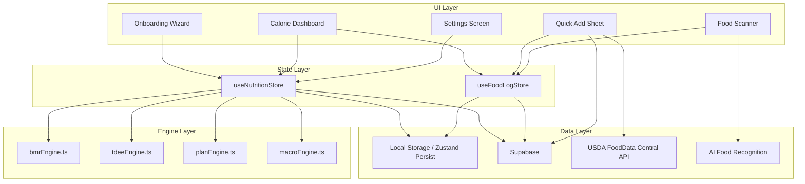

# Design Document: Calorie Tracker

## Overview

The Calorie Tracker feature adds a comprehensive nutrition tracking system to InTracker Mobile. It consists of four major subsystems:

1. **Onboarding Wizard** — A 4-step flow collecting body metrics, fitness goal, timeframe, and activity level
2. **Calculation Engine** — Pure functions computing BMR, TDEE, daily calorie targets, and macronutrient splits using the Mifflin-St Jeor equation with goal/age/preference adjustments
3. **Food Logging** — Quick Add (search + manual), AI photo scan, and food entry management with local-first persistence and Supabase sync
4. **Dashboard** — Progress ring, macro bars, weekly chart, date navigation, and grouped food log display

The system follows a local-first architecture: all calculations and state are managed client-side via Zustand stores with `persist` middleware, syncing to Supabase when connectivity is available. The calculation engine is implemented as pure functions in `src/engines/` (matching the existing `statsEngine.ts` and `xpEngine.ts` pattern), making them independently testable.

## Architecture



### Design Decisions

1. **Pure engine functions** — All calculation logic (BMR, TDEE, calorie targets, macros) lives in pure functions under `src/engines/`. This matches the existing `statsEngine.ts` pattern and enables property-based testing without mocking.

2. **Two Zustand stores** — `useNutritionStore` manages user profile and calculated targets; `useFoodLogStore` manages food entries. Separation keeps concerns clean and allows independent sync strategies.

3. **Local-first with optimistic updates** — Following the existing `useHabitStore` pattern: write to local state immediately, sync to Supabase in the background, retry on failure.

4. **USDA API as supplementary source** — The Supabase `food_items` table is the primary search source (500+ seeded items). USDA API results are fetched in parallel and merged below local results, then cached for future use.

5. **AI photo scan via OpenAI/Gemini Vision** — The AI service is called only for photo analysis. The API key is stored server-side (Supabase Edge Function) to avoid exposing it in the client bundle.

## Components and Interfaces

### Engine Functions (`src/engines/`)

```typescript
// src/engines/nutritionEngine.ts

// --- BMR Engine ---
interface BmrInput {
  sex: 'male' | 'female';
  weight: number;   // kg, 20.0-300.0
  height: number;   // cm, 100-250
  age: number;      // years, 13-120
}

interface BmrResult {
  success: true;
  bmr: number; // kcal/day, whole number
}

interface BmrError {
  success: false;
  error: string;
  field?: string;
}

type BmrOutput = BmrResult | BmrError;

function calculateBmr(input: BmrInput): BmrOutput;

// --- TDEE Engine ---
type ActivityMultiplier = 1.2 | 1.375 | 1.55 | 1.725 | 1.9;

interface TdeeInput {
  bmr: number;
  activityMultiplier: ActivityMultiplier;
}

function calculateTdee(input: TdeeInput): number; // whole number kcal/day

// --- Plan Engine ---
type FitnessGoal = 
  | 'lose_fat_keep_muscle'
  | 'aggressive_fat_loss'
  | 'lean_bulk'
  | 'bulk'
  | 'body_recomposition'
  | 'maintain_weight';

type DietaryPreference = 'no_preference' | 'vegetarian' | 'vegan' | 'keto' | 'paleo';

interface CalorieTargetInput {
  tdee: number;
  goal: FitnessGoal;
  sex: 'male' | 'female';
  age: number;
}

function calculateCalorieTarget(input: CalorieTargetInput): number; // whole number kcal/day

// --- Macro Engine ---
interface MacroInput {
  dailyCalories: number;
  dietaryPreference: DietaryPreference;
  goal: FitnessGoal;
  age: number;
}

interface MacroTargets {
  protein: number; // grams, whole number
  carbs: number;   // grams, whole number
  fat: number;     // grams, whole number
}

function calculateMacros(input: MacroInput): MacroTargets;

// --- Weekly Rate ---
interface WeeklyRateInput {
  currentWeight: number;
  targetWeight: number;
  durationWeeks: number;
}

interface WeeklyRateResult {
  ratePerWeek: number;       // kg/week, 1 decimal
  isAggressive: boolean;     // true if > 1.0 loss or > 0.5 gain per week
}

function calculateWeeklyRate(input: WeeklyRateInput): WeeklyRateResult;
```

### Dashboard Calculation Utilities (`src/engines/dashboardEngine.ts`)

```typescript
interface ProgressRingData {
  fillPercentage: number;    // 0-100, capped at 100
  consumed: number;          // total kcal consumed
  target: number;            // daily target kcal
  remaining: number;         // can be negative if over-target
}

interface MacroBarData {
  protein: { consumed: number; target: number; fillPercentage: number; isOver: boolean };
  carbs: { consumed: number; target: number; fillPercentage: number; isOver: boolean };
  fat: { consumed: number; target: number; fillPercentage: number; isOver: boolean };
}

interface WeeklyChartData {
  days: Array<{ date: string; dayLabel: string; calories: number; isToday: boolean }>;
  averageCalories: number;   // average of days with entries only
  daysLogged: number;        // count of days with at least one entry
}

function calculateProgressRing(consumed: number, target: number): ProgressRingData;
function calculateMacroBars(consumed: MacroTargets, target: MacroTargets): MacroBarData;
function calculateWeeklyChart(entries: FoodEntry[], weekStartDate: Date, today: Date): WeeklyChartData;
```

### Food Log Utilities (`src/engines/foodLogEngine.ts`)

```typescript
type MealType = 'breakfast' | 'lunch' | 'dinner' | 'snack';

interface FoodEntry {
  id: string;
  userId: string;
  date: string;            // YYYY-MM-DD
  mealType: MealType;
  foodName: string;        // 1-100 chars
  calories: number;        // 0-99999
  protein: number;         // 0-9999.9
  carbs: number;           // 0-9999.9
  fat: number;             // 0-9999.9
  createdAt: string;       // ISO timestamp
  isDeleted?: boolean;     // soft delete for sync
  source?: 'manual' | 'search' | 'usda' | 'ai_scan';
}

interface GroupedFoodLog {
  mealType: MealType;
  entries: FoodEntry[];
  totalCalories: number;
}

const MEAL_TYPE_ORDER: MealType[] = ['breakfast', 'lunch', 'dinner', 'snack'];

function groupEntriesByMealType(entries: FoodEntry[]): GroupedFoodLog[];
function getMealTypeByTime(hour: number): MealType;
function calculateDailyTotals(entries: FoodEntry[]): { calories: number; protein: number; carbs: number; fat: number };
```

### Zustand Stores

```typescript
// src/store/useNutritionStore.ts
interface UserProfile {
  sex: 'male' | 'female';
  height: number;
  weight: number;
  age: number;
  goal: FitnessGoal;
  activityLevel: ActivityMultiplier;
  dietaryPreference: DietaryPreference;
  targetWeight?: number;
  durationWeeks?: number;
}

interface NutritionTargets {
  dailyCalories: number;
  protein: number;
  carbs: number;
  fat: number;
}

interface NutritionStore {
  profile: UserProfile | null;
  targets: NutritionTargets | null;
  onboardingComplete: boolean;
  loading: boolean;
  setProfile: (profile: UserProfile) => void;
  generatePlan: () => void;
  updateProfile: (updates: Partial<UserProfile>) => void;
  syncToSupabase: () => Promise<void>;
  restoreFromSupabase: () => Promise<void>;
}

// src/store/useFoodLogStore.ts
interface FoodLogStore {
  entries: FoodEntry[];
  selectedDate: string;          // YYYY-MM-DD
  pendingSync: FoodEntry[];      // entries awaiting Supabase sync
  syncRetryCount: Record<string, number>;
  addEntry: (entry: Omit<FoodEntry, 'id' | 'userId' | 'createdAt'>) => void;
  deleteEntry: (id: string) => void;
  setSelectedDate: (date: string) => void;
  getEntriesForDate: (date: string) => FoodEntry[];
  syncToSupabase: () => Promise<void>;
  reconcileWithSupabase: () => Promise<void>;
}
```

### UI Components

| Component | Location | Purpose |
|-----------|----------|---------|
| `OnboardingWizard` | `src/mainscreen/nutrition/OnboardingWizard.tsx` | 4-step setup flow |
| `CalorieDashboard` | `src/mainscreen/nutrition/CalorieDashboard.tsx` | Main nutrition view |
| `ProgressRing` | `src/mainscreen/nutrition/components/ProgressRing.tsx` | Circular calorie progress |
| `MacroBars` | `src/mainscreen/nutrition/components/MacroBars.tsx` | Protein/carbs/fat bars |
| `WeeklyChart` | `src/mainscreen/nutrition/components/WeeklyChart.tsx` | 7-day bar chart |
| `FoodLog` | `src/mainscreen/nutrition/components/FoodLog.tsx` | Grouped food entries |
| `QuickAddSheet` | `src/mainscreen/nutrition/QuickAddSheet.tsx` | Bottom sheet for food entry |
| `FoodScanner` | `src/mainscreen/nutrition/FoodScanner.tsx` | Photo-based food recognition |
| `NutritionSettings` | `src/mainscreen/nutrition/NutritionSettings.tsx` | Profile/target editing |
| `DateNavigator` | `src/mainscreen/nutrition/components/DateNavigator.tsx` | Day navigation arrows |

### External Service Integration

```typescript
// src/lib/usdaApi.ts
interface UsdaSearchResult {
  fdcId: number;
  description: string;
  servingSize: number;
  servingSizeUnit: string;
  calories: number;
  protein: number;
  carbs: number;
  fat: number;
}

async function searchUsda(query: string): Promise<UsdaSearchResult[]>;

// src/lib/foodScanner.ts (calls Supabase Edge Function)
interface ScannedFoodItem {
  name: string;
  calories: number;
  protein: number;
  carbs: number;
  fat: number;
  confidence: number;
}

async function analyzeFoodPhoto(imageBase64: string): Promise<ScannedFoodItem[]>;
```

## Data Models

### Supabase Tables

```sql
-- User nutrition profile
CREATE TABLE nutrition_profiles (
  id UUID PRIMARY KEY DEFAULT gen_random_uuid(),
  user_id UUID REFERENCES auth.users(id) ON DELETE CASCADE,
  sex TEXT NOT NULL CHECK (sex IN ('male', 'female')),
  height INTEGER NOT NULL CHECK (height BETWEEN 100 AND 250),
  weight DECIMAL(5,1) NOT NULL CHECK (weight BETWEEN 20.0 AND 300.0),
  age INTEGER NOT NULL CHECK (age BETWEEN 13 AND 120),
  goal TEXT NOT NULL,
  activity_multiplier DECIMAL(4,3) NOT NULL,
  dietary_preference TEXT NOT NULL DEFAULT 'no_preference',
  target_weight DECIMAL(5,1) CHECK (target_weight BETWEEN 30.0 AND 300.0),
  duration_weeks INTEGER CHECK (duration_weeks IN (4, 8, 12, 16)),
  daily_calories INTEGER NOT NULL,
  protein_grams INTEGER NOT NULL,
  carbs_grams INTEGER NOT NULL,
  fat_grams INTEGER NOT NULL,
  created_at TIMESTAMPTZ DEFAULT NOW(),
  updated_at TIMESTAMPTZ DEFAULT NOW(),
  UNIQUE(user_id)
);

-- Food log entries
CREATE TABLE food_entries (
  id UUID PRIMARY KEY DEFAULT gen_random_uuid(),
  user_id UUID REFERENCES auth.users(id) ON DELETE CASCADE,
  date DATE NOT NULL,
  meal_type TEXT NOT NULL CHECK (meal_type IN ('breakfast', 'lunch', 'dinner', 'snack')),
  food_name TEXT NOT NULL CHECK (char_length(food_name) BETWEEN 1 AND 100),
  calories INTEGER NOT NULL CHECK (calories BETWEEN 0 AND 99999),
  protein DECIMAL(6,1) NOT NULL CHECK (protein BETWEEN 0 AND 9999.9),
  carbs DECIMAL(6,1) NOT NULL CHECK (carbs BETWEEN 0 AND 9999.9),
  fat DECIMAL(6,1) NOT NULL CHECK (fat BETWEEN 0 AND 9999.9),
  source TEXT DEFAULT 'manual',
  is_deleted BOOLEAN DEFAULT FALSE,
  created_at TIMESTAMPTZ DEFAULT NOW()
);

CREATE INDEX idx_food_entries_user_date ON food_entries(user_id, date);
CREATE INDEX idx_food_entries_sync ON food_entries(user_id, is_deleted);

-- Food database (seeded + cached USDA items)
CREATE TABLE food_items (
  id UUID PRIMARY KEY DEFAULT gen_random_uuid(),
  food_name TEXT NOT NULL,
  category TEXT NOT NULL,
  serving_description TEXT NOT NULL,
  serving_weight_grams DECIMAL(7,1) NOT NULL,
  calories INTEGER NOT NULL,
  protein DECIMAL(6,1) NOT NULL,
  carbs DECIMAL(6,1) NOT NULL,
  fat DECIMAL(6,1) NOT NULL,
  data_source TEXT NOT NULL CHECK (data_source IN ('seed', 'usda', 'ai')),
  usda_fdc_id INTEGER,
  search_terms TEXT[], -- includes Indonesian translations
  created_at TIMESTAMPTZ DEFAULT NOW()
);

CREATE INDEX idx_food_items_search ON food_items USING GIN(search_terms);
CREATE INDEX idx_food_items_name ON food_items USING GIN(to_tsvector('simple', food_name));

-- Indonesian-English food term translations
CREATE TABLE food_translations (
  id UUID PRIMARY KEY DEFAULT gen_random_uuid(),
  indonesian_term TEXT NOT NULL UNIQUE,
  english_term TEXT NOT NULL
);
```

### Row Level Security

```sql
-- nutrition_profiles: users can only access their own profile
ALTER TABLE nutrition_profiles ENABLE ROW LEVEL SECURITY;
CREATE POLICY "Users manage own profile" ON nutrition_profiles
  FOR ALL USING (auth.uid() = user_id);

-- food_entries: users can only access their own entries
ALTER TABLE food_entries ENABLE ROW LEVEL SECURITY;
CREATE POLICY "Users manage own entries" ON food_entries
  FOR ALL USING (auth.uid() = user_id);

-- food_items: readable by all authenticated users, writable for caching
ALTER TABLE food_items ENABLE ROW LEVEL SECURITY;
CREATE POLICY "Authenticated users read food items" ON food_items
  FOR SELECT USING (auth.role() = 'authenticated');
CREATE POLICY "Authenticated users insert cached items" ON food_items
  FOR INSERT WITH CHECK (auth.role() = 'authenticated' AND data_source IN ('usda', 'ai'));
```

## Correctness Properties

*A property is a characteristic or behavior that should hold true across all valid executions of a system — essentially, a formal statement about what the system should do. Properties serve as the bridge between human-readable specifications and machine-verifiable correctness guarantees.*

### Property 1: BMR Calculation Correctness

*For any* valid combination of sex (male/female), weight (20.0–300.0 kg), height (100–250 cm), and age (13–120 years), the `calculateBmr` function SHALL return a whole number equal to `round((10 × weight) + (6.25 × height) − (5 × age) + offset)` where offset is +5 for male and −161 for female, using round-half-up.

**Validates: Requirements 5.1, 5.2, 5.3, 5.4**

### Property 2: TDEE Calculation Correctness

*For any* valid BMR value and valid activity multiplier (1.2, 1.375, 1.55, 1.725, or 1.9), the `calculateTdee` function SHALL return a whole number equal to `round(BMR × multiplier)` using round-half-up.

**Validates: Requirements 6.1, 6.2, 6.3**

### Property 3: Calorie Target Floor and Cap Enforcement

*For any* valid TDEE, fitness goal, sex, and age, the `calculateCalorieTarget` function SHALL return a value that is: (a) never below 1200 for females aged 18+ or 1500 for males aged 18+, (b) never below 1400 for females aged 13–17 or 1600 for males aged 13–17, and (c) never above 5000.

**Validates: Requirements 7.7, 7.8, 7.9, 19.6**

### Property 4: Calorie Target Goal Adjustment

*For any* valid TDEE and fitness goal, the `calculateCalorieTarget` function SHALL apply the correct percentage adjustment (−20% for Lose Fat Keep Muscle, −30% for Aggressive Fat Loss, +10% for Lean Bulk, +20% for Bulk, 0% for Body Recomposition and Maintain Weight) before applying floor/cap constraints.

**Validates: Requirements 7.1, 7.2, 7.3, 7.4, 7.5, 7.6**

### Property 5: Macro Calorie Sum Invariant

*For any* valid daily calorie target, dietary preference, fitness goal, and age, the macro targets returned by `calculateMacros` SHALL satisfy: `|(protein × 4 + carbs × 4 + fat × 9) − dailyCalories| ≤ 10`.

**Validates: Requirements 8.7**

### Property 6: Macro Percentage Split Correctness

*For any* valid daily calorie target, dietary preference, fitness goal, and age, the macro percentages used by `calculateMacros` SHALL: (a) sum to 100%, (b) never have carbs below 10%, and (c) never have the combined protein increase from goal and age adjustments exceed 15 percentage points above the base split.

**Validates: Requirements 8.1, 8.2, 8.3, 8.4, 19.1, 19.2, 19.3, 19.4, 19.5**

### Property 7: Weekly Change Rate Calculation

*For any* valid current weight, target weight (30–300 kg), and duration (4, 8, 12, or 16 weeks), the `calculateWeeklyRate` function SHALL return a rate equal to `(targetWeight − currentWeight) / durationWeeks` rounded to one decimal place, and `isAggressive` SHALL be true if and only if the rate is less than −1.0 or greater than +0.5.

**Validates: Requirements 3.3, 3.4**

### Property 8: Dashboard Progress Ring Calculation

*For any* non-negative consumed calories and positive target calories, the `calculateProgressRing` function SHALL return: (a) `fillPercentage` equal to `min(100, (consumed / target) × 100)`, (b) `remaining` equal to `target − consumed` (which may be negative).

**Validates: Requirements 10.1, 10.2, 10.4**

### Property 9: Weekly Average Calculation

*For any* set of food entries across a 7-day week, the `calculateWeeklyChart` function SHALL return: (a) `averageCalories` equal to the sum of calories on days with at least one entry divided by the count of such days, (b) `daysLogged` equal to the count of days with at least one entry, and (c) if no days have entries, both values SHALL be 0.

**Validates: Requirements 12.2, 12.3, 12.6**

### Property 10: Food Log Grouping by Meal Type

*For any* set of food entries for a given date, the `groupEntriesByMealType` function SHALL return groups in the fixed order [breakfast, lunch, dinner, snack], including only groups that contain at least one entry, and every entry SHALL appear in exactly one group matching its `mealType` field.

**Validates: Requirements 15.1, 15.6**

### Property 11: Meal Type Default by Time of Day

*For any* hour value (0–23), the `getMealTypeByTime` function SHALL return: 'breakfast' for hours 0–10, 'lunch' for hours 11–14, 'dinner' for hours 15–20, and 'snack' for hours 21–23.

**Validates: Requirements 13.7, 14.2**

## Error Handling

| Scenario | Handling Strategy |
|----------|-------------------|
| BMR/TDEE input validation failure | Return error result with field identification; UI shows inline error |
| Plan generation failure | Display error toast, retain user selections, allow retry |
| Supabase profile save failure | Retain in local state, retry on next sync opportunity |
| Food entry sync failure | Queue in `pendingSync`, retry up to 5 times per entry |
| USDA API timeout (>3s) | Show "search unavailable" message, allow manual entry |
| USDA API rate limit (1000/hr) | Fall back to local results only, show subtle indicator |
| AI photo scan timeout (>30s) | Cancel request, show timeout error, offer Quick Add fallback |
| AI photo scan no food detected | Show "no food detected" message, offer retry or Quick Add |
| Image too large (>10MB) | Reject before upload, show size error message |
| Network offline | Use local data only, show offline indicator, queue syncs |
| Invalid fitness goal / dietary preference | Default to safe values (maintain weight / balanced split) |

### Sync Strategy

Following the existing `useHabitStore` pattern:
1. **Write**: Optimistic local update → background Supabase sync
2. **Read**: Load from local state first (< 100ms) → reconcile with Supabase when online
3. **Conflict resolution**: Use `createdAt` timestamp; most recent wins. Soft-deleted entries stay deleted.
4. **Retry**: Max 5 consecutive failures per entry, then wait for next app launch

## Testing Strategy

### Property-Based Tests (fast-check)

The calculation engine functions are pure and have well-defined input/output behavior with large input spaces, making them ideal for property-based testing. Each property test runs a minimum of 100 iterations.

**Library**: `fast-check` (already installed in devDependencies)
**Runner**: `vitest` (already configured)
**Location**: `src/engines/nutritionEngine.property.test.ts`

Properties to implement:
- Property 1: BMR formula correctness
- Property 2: TDEE formula correctness
- Property 3: Calorie target floor/cap enforcement
- Property 4: Calorie target goal adjustment
- Property 5: Macro calorie sum invariant (≤10 kcal deviation)
- Property 6: Macro percentage split correctness (sum=100%, carbs≥10%, protein cap)
- Property 7: Weekly change rate calculation
- Property 8: Dashboard progress ring calculation
- Property 9: Weekly average calculation
- Property 10: Food log grouping by meal type
- Property 11: Meal type default by time of day

Each test tagged with: `Feature: calorie-tracker, Property {N}: {title}`

### Unit Tests (vitest)

- Onboarding wizard step navigation and validation
- Settings screen field editing and save
- Date navigation boundary conditions (90 days past, 7 days future)
- Food entry CRUD operations
- Search result merging (local + USDA)
- Indonesian-English translation lookup
- Quick Add form validation

### Integration Tests

- Supabase profile persistence and restore
- Food entry sync and reconciliation
- USDA API search and caching
- AI photo scan request/response flow
- Offline mode behavior
