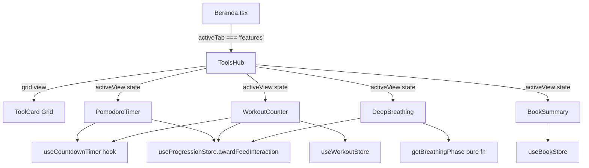

# Dokumen Desain: Features Tools Page

## Overview

Features Tools Page menggantikan tampilan placeholder "Experimental Laboratory" di route `/features` dengan hub mini-tools yang fungsional. Halaman ini menampilkan grid 2 kolom berisi kartu tool yang bisa ditekan untuk membuka tampilan full-screen masing-masing tool. Hub berisi lima tool: Pomodoro Timer, Workout Counter, Deep Breathing, Book Summary (Perpustakaan), dan Screen Blocker (placeholder Coming Soon).

Setiap tool adalah komponen terpisah di `src/mainscreen/features/`. Tool yang melibatkan penyelesaian sesi (Pomodoro, Workout, Breathing) memberikan XP melalui `useProgressionStore.getState().awardFeedInteraction()`. Halaman ini terintegrasi dengan shell Beranda yang sudah ada — komponen `FeaturesView` diganti dengan komponen `ToolsHub` baru yang mengelola navigasi internal antara grid dan tampilan tool individual.

### Keputusan Desain Utama

1. **Navigasi berbasis state internal** — ToolsHub mengelola view stack sendiri via `useState<'grid' | 'pomodoro' | 'workout' | 'breathing' | 'books'>`. Ini menghindari penambahan sub-route ke React Router dan menjaga fitur tetap self-contained dalam sistem tab Beranda yang sudah ada.

2. **Custom hook `useCountdownTimer` yang di-share** — digunakan oleh Pomodoro dan Workout untuk menghindari duplikasi logika timer.

3. **Fungsi pure `getBreathingPhase()`** — diberikan elapsed seconds, mengembalikan fase saat ini secara deterministik (`phases[Math.floor(elapsed / 4) % 4]`), mudah di-test dengan property-based testing.

4. **Data buku statis** dimuat dari file TypeScript (`src/data/bookSummaries.ts`) — tidak perlu panggilan backend. Status "Done" disimpan via Zustand dengan localStorage persist.

5. **Riwayat workout** disimpan di Zustand store dengan localStorage persist — tidak ada dependensi Supabase untuk fitur ini.

## Architecture



### Struktur File

```
src/mainscreen/features/
├── ToolsHub.tsx              # Grid utama + router view internal
├── ToolCard.tsx              # Komponen kartu reusable
├── PomodoroTimer.tsx         # Tampilan tool Pomodoro
├── WorkoutCounter.tsx        # Tampilan tool Workout
├── DeepBreathing.tsx         # Tampilan tool Breathing
├── BookSummary.tsx           # Tampilan perpustakaan buku
├── BookReader.tsx            # Reader ringkasan buku lengkap
├── ComingSoonModal.tsx       # Modal untuk tool yang belum tersedia
├── hooks/
│   └── useCountdownTimer.ts  # Logika countdown yang di-share
├── utils/
│   └── breathingPhase.ts     # Kalkulasi fase pure
└── stores/
    ├── useWorkoutStore.ts    # Sesi workout & riwayat
    └── useBookStore.ts       # Progress membaca buku
```

## Components and Interfaces

### ToolsHub (Container Utama)

```typescript
interface ToolsHubProps {}

// State internal
type ActiveView = 'grid' | 'pomodoro' | 'workout' | 'breathing' | 'books';

// Mengelola transisi view dengan AnimatePresence
// Render grid ToolCard saat activeView === 'grid'
// Render komponen tool individual untuk state lainnya
// Menyediakan tombol back overlay saat di tool view
```

### ToolCard

```typescript
interface ToolCardProps {
  id: string;
  title: string;
  description: string;
  backgroundImage?: string;       // Opsional — fallback ke gradient
  gradientFrom?: string;          // Default: '#1c1e22'
  gradientTo?: string;            // Default: '#141518'
  comingSoon?: boolean;
  onPress: () => void;
}
```

### PomodoroTimer

```typescript
interface PomodoroTimerProps {
  onBack: () => void;
}

// Opsi durasi: [15, 25, 30, 45, 60, 75, 90] menit
// State: 'idle' | 'running' | 'paused' | 'break'
// Saat selesai: vibrate, play sound, award XP, tawarkan break
```

### WorkoutCounter

```typescript
interface WorkoutCounterProps {
  onBack: () => void;
}

type ExerciseName = 'Push-Up' | 'Sit-Up' | 'Plank' | 'Lari' | 'Yoga' | 'Stretching' | 'Lompat Tali' | 'Squat' | 'Burpee';

interface ExerciseEntry {
  name: ExerciseName;
  reps: number;
  timeSeconds: number;
  sets: number;
}

interface WorkoutSession {
  id: string;
  exercises: ExerciseEntry[];
  completedAt: string;  // ISO date
  totalDuration: number; // detik
}

// View: 'menu' | 'configure' | 'active' | 'history'
// Sesi aktif melacak: currentExerciseIndex, currentSet, timeRemaining
```

### DeepBreathing

```typescript
interface DeepBreathingProps {
  onBack: () => void;
}

type BreathingPhase = 'Inhale' | 'Hold' | 'Exhale' | 'Hold2';

// Durasi sesi: 180 detik (3 menit)
// Siklus fase: 4 detik × 4 fase = 16 detik per siklus
// Animasi: scale 1.0 → 1.5 (inhale), hold, 1.5 → 1.0 (exhale), hold
```

### BookSummary

```typescript
interface BookSummaryProps {
  onBack: () => void;
}

interface BookEntry {
  id: string;
  title: string;
  author: string;
  category: BookCategory;
  rating: number;           // 1-5
  readingTimeMinutes: number;
  coverImage?: string;
  summary: string;          // Teks ringkasan lengkap (markdown)
}

type BookCategory = 'Psychology' | 'Productivity' | 'Wealth' | 'Philosophy' | 'Personal Development' | 'Leadership' | 'Life';

type BookFilter = 'Recommended' | 'Done' | BookCategory;
```

### useCountdownTimer Hook

```typescript
interface UseCountdownTimerOptions {
  initialSeconds: number;
  onComplete: () => void;
  onTick?: (remaining: number) => void;
}

interface UseCountdownTimerReturn {
  remaining: number;          // detik tersisa
  isRunning: boolean;
  isPaused: boolean;
  start: () => void;
  pause: () => void;
  resume: () => void;
  stop: () => void;           // reset ke initialSeconds
  reset: (newSeconds?: number) => void;
}
```

### breathingPhase Utility

```typescript
// Fungsi pure — tanpa side effects
function getBreathingPhase(elapsedSeconds: number): {
  phase: BreathingPhase;
  phaseProgress: number;  // 0-1 progress dalam fase 4 detik saat ini
  cycleCount: number;     // berapa siklus penuh yang sudah selesai
}
```

### useWorkoutStore

```typescript
interface WorkoutState {
  sessions: WorkoutSession[];
  weeklyCompleted: Record<string, boolean>; // 'mon'|'tue'|...|'sun' → boolean
}

interface WorkoutActions {
  addSession: (session: WorkoutSession) => void;
  getWeeklyProgress: () => boolean[]; // [mon, tue, wed, thu, fri, sat, sun]
  clearHistory: () => void;
}
```

### useBookStore

```typescript
interface BookState {
  completedBookIds: string[];
}

interface BookActions {
  markAsDone: (bookId: string) => void;
  isBookDone: (bookId: string) => boolean;
  getCompletedBooks: () => string[];
}
```

## Data Models

### Tool Card Registry (Statis)

```typescript
const TOOL_CARDS = [
  {
    id: 'pomodoro',
    title: 'Pomodoro Timer',
    description: 'Focus timer untuk deep work sessions',
    backgroundImage: '/all_images/features/pomodoro_card.png',
  },
  {
    id: 'workout',
    title: 'Workout Counter',
    description: 'Track workout sessions & earn XP',
    backgroundImage: '/all_images/features/workout_card.png',
  },
  {
    id: 'breathing',
    title: 'Deep Breathing',
    description: 'Box breathing untuk ketenangan',
    backgroundImage: '/all_images/features/breathing_card.png',
  },
  {
    id: 'books',
    title: 'Perpustakaan',
    description: 'Ringkasan buku pilihan',
    backgroundImage: '/all_images/features/book_card.png',
  },
  {
    id: 'blocker',
    title: 'Screen Blocker',
    description: 'Blokir distraksi digital',
    comingSoon: true,
    backgroundImage: '/all_images/features/blocker_card.png',
  },
] as const;
```

### Data Buku (File TypeScript Statis)

```typescript
// src/data/bookSummaries.ts
export const BOOK_LIBRARY: BookEntry[] = [
  {
    id: 'atomic-habits',
    title: 'Atomic Habits',
    author: 'James Clear',
    category: 'Productivity',
    rating: 5,
    readingTimeMinutes: 8,
    summary: '...',  // Konten markdown
  },
  // ... buku lainnya
];
```

### Workout Session (Disimpan via Zustand + localStorage)

```typescript
// Disimpan di useWorkoutStore dengan persist middleware
// Key: 'intracker-workout-store'
{
  sessions: WorkoutSession[];
  weeklyCompleted: { mon: false, tue: true, ... };
}
```

### Book Progress (Disimpan via Zustand + localStorage)

```typescript
// Disimpan di useBookStore dengan persist middleware
// Key: 'intracker-book-store'
{
  completedBookIds: ['atomic-habits', 'deep-work'];
}
```

## Correctness Properties

*Property adalah karakteristik atau perilaku yang harus selalu benar di semua eksekusi valid dari sebuah sistem — pada dasarnya, pernyataan formal tentang apa yang seharusnya dilakukan sistem. Properties menjembatani antara spesifikasi yang bisa dibaca manusia dan jaminan kebenaran yang bisa diverifikasi mesin.*

### Property 1: Kelengkapan rendering tool card

*For any* data tool card valid yang berisi title, description, dan image path, rendering komponen ToolCard harus menghasilkan output yang mengandung teks title dan teks description.

**Validates: Requirements 1.2**

### Property 2: Kebenaran navigasi tool card

*For any* tool card di registry TOOL_CARDS yang tidak ditandai `comingSoon`, menekan kartu tersebut harus mengubah state `activeView` ToolsHub ke identifier view tool yang sesuai.

**Validates: Requirements 1.5**

### Property 3: Inisialisasi countdown timer

*For any* durasi valid dari set [15, 25, 30, 45, 60, 75, 90] menit, memulai timer Pomodoro harus menginisialisasi nilai `remaining` countdown ke tepat `durasi × 60` detik.

**Validates: Requirements 2.3**

### Property 4: Pause membekukan state timer

*For any* nilai waktu tersisa T dimana 0 < T ≤ selectedDuration × 60, mem-pause timer harus menghasilkan nilai `remaining` tetap konstan di T (tidak berkurang) sampai resume dipanggil.

**Validates: Requirements 2.5**

### Property 5: Stop mereset tanpa XP

*For any* state timer (running atau paused) dengan waktu elapsed berapa pun, memanggil stop harus mereset `remaining` ke durasi yang dipilih semula dalam detik, mengubah state ke 'idle', dan tidak memanggil `awardFeedInteraction`.

**Validates: Requirements 2.6, 7.4**

### Property 6: Ketersediaan konfigurasi exercise

*For any* subset non-kosong dari daftar exercise valid, memilih exercise-exercise tersebut harus menghasilkan setiap exercise yang dipilih memiliki field Reps, Time, dan Sets yang bisa dikonfigurasi dalam konfigurasi sesi.

**Validates: Requirements 3.3, 3.4**

### Property 7: Kebenaran format set tracking

*For any* exercise entry dengan jumlah sets N (dimana 1 ≤ N ≤ 20), selama eksekusi workout aktif, tampilan harus menunjukkan "Set X/N" dimana X bertambah dari 1 ke N saat set diselesaikan.

**Validates: Requirements 3.5**

### Property 8: Akurasi weekly progress grid

*For any* subset hari (Senin sampai Minggu) yang memiliki sesi workout selesai di minggu ini, Weekly_Progress_Grid harus menampilkan indikator aktif untuk tepat hari-hari tersebut dan indikator tidak aktif untuk hari sisanya.

**Validates: Requirements 3.7**

### Property 9: Determinisme fase breathing

*For any* waktu elapsed T (dalam detik, dimana 0 ≤ T < sessionLength), fase breathing yang dikembalikan oleh `getBreathingPhase(T)` harus sama dengan `phases[Math.floor(T / 4) % 4]` dimana phases = ['Inhale', 'Hold', 'Exhale', 'Hold2'], dan fase harus bersiklus terus-menerus selama durasi sesi.

**Validates: Requirements 4.2, 4.4, 4.7**

### Property 10: Kelengkapan rendering book card

*For any* BookEntry valid yang berisi title, author, rating (1-5), dan readingTimeMinutes (> 0), rendering book card harus menghasilkan output yang mengandung title, nama author, representasi star rating, dan reading time.

**Validates: Requirements 5.3**

### Property 11: Round-trip status "Done" buku

*For any* buku di perpustakaan, memanggil `markAsDone(bookId)` lalu memanggil `isBookDone(bookId)` harus mengembalikan `true`, dan buku tersebut harus muncul di hasil saat filter 'Done' diterapkan.

**Validates: Requirements 5.7**

### Property 12: Pembatalan mencegah XP award

*For any* tool (Pomodoro, Workout, atau Breathing) dan titik waktu mana pun sebelum penyelesaian sesi, menghentikan atau membatalkan sesi harus menghasilkan nol panggilan ke `awardFeedInteraction`.

**Validates: Requirements 7.4**

## Error Handling

| Skenario | Penanganan |
|----------|------------|
| Asset gambar tidak ditemukan | Render gradient placeholder (`#1c1e22` → `#141518`) via fallback `onError` |
| Timer mencapai 0 tapi Vibration API tidak tersedia | Catch dan abaikan — XP award tetap berjalan |
| Playback audio gagal (notification sound) | Catch dan abaikan — indikator visual completion ditampilkan sebagai gantinya |
| Workout store corrupt/kosong | Inisialisasi dengan array sessions kosong, tampilkan empty state |
| File data buku hilang/malformed | Kompilasi TypeScript akan menangkap ini saat build (static import) |
| Kuota localStorage terlampaui | Zustand persist menangani dengan graceful — state hidup di memory saja |
| User navigasi keluar saat sesi aktif | Timer/sesi pause otomatis via cleanup `useEffect`; tidak ada XP yang diberikan |
| Konfigurasi exercise invalid (0 reps, 0 sets) | Validasi input — tombol Start disabled sampai semua entry punya nilai valid (reps ≥ 1, sets ≥ 1) |

## Testing Strategy

### Unit Tests (Vitest)

- **Timer hook**: Test transisi state start/pause/resume/stop dengan contoh spesifik
- **Breathing phase utility**: Test nilai batas (0s, 3s, 4s, 15s, 16s)
- **Workout store**: Test addSession, getWeeklyProgress dengan data konkret
- **Book store**: Test markAsDone, isBookDone dengan book ID spesifik
- **Integrasi XP**: Mock `useProgressionStore` dan verifikasi `awardFeedInteraction` dipanggil saat completion dan TIDAK dipanggil saat cancellation
- **Komponen ToolCard**: Snapshot test untuk varian active vs coming-soon

### Property-Based Tests (fast-check + Vitest)

Property-based testing cocok untuk fitur ini karena beberapa tool mengandung fungsi logika pure dengan perilaku input/output yang jelas dan properti universal yang berlaku di rentang input yang luas.

**Konfigurasi:**
- Library: `fast-check` (sudah ada di devDependencies)
- Runner: `vitest`
- Minimum iterasi: 100 per property test
- Setiap test ditag dengan: `Feature: features-tools-page, Property {N}: {title}`

**Properties yang diimplementasi:**
1. Determinisme fase breathing (Property 9) — fungsi pure, ruang input tak terbatas
2. Inisialisasi countdown timer (Property 3) — verifikasi untuk semua durasi valid
3. Pause membekukan state (Property 4) — verifikasi untuk semua nilai waktu tersisa
4. Stop mereset tanpa XP (Property 5) — verifikasi untuk semua state timer
5. Round-trip "Done" buku (Property 11) — verifikasi untuk book ID apa pun
6. Akurasi weekly progress grid (Property 8) — verifikasi untuk kombinasi hari apa pun
7. Kelengkapan rendering tool card (Property 1) — verifikasi untuk data card apa pun
8. Pembatalan mencegah XP (Property 12) — verifikasi lintas tool dan titik waktu

### Integration Tests

- Alur navigasi: grid → tool → kembali ke grid
- XP award end-to-end: selesaikan sesi Pomodoro dan verifikasi perubahan state store
- Persistensi sesi workout: konfigurasi → selesaikan → verifikasi di riwayat

### Manual Testing

- Verifikasi visual animasi (lingkaran breathing, transisi timer)
- Haptic feedback saat session completion
- Playback audio notifikasi
- Layout responsif di berbagai ukuran layar
