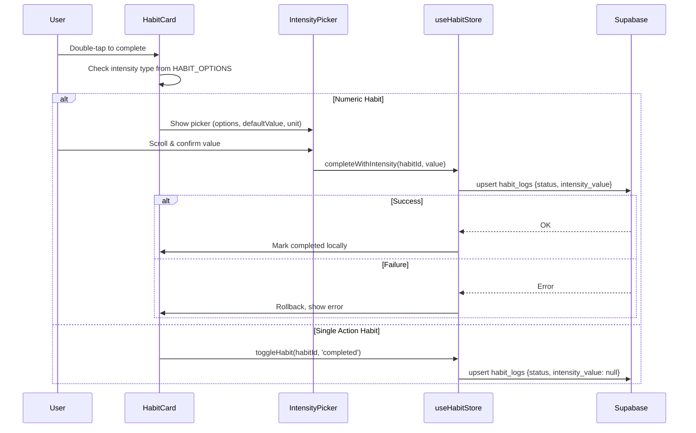

# Design Document: Habit Intensity System

## Overview

The Habit Intensity System completes the intensity tracking infrastructure in InTracker Mobile by connecting three layers: display (habit cards showing target intensity), input (premium scroll-wheel picker during completion), and output (analytics bar chart using actual intensity values). The system distinguishes between **Numeric Habits** (27 habits with quantifiable targets) and **Single Action Habits** (binary done/not-done), ensuring each type flows through the correct UI and data path.

The design leverages the existing `HABIT_OPTIONS` configuration as the single source of truth for intensity metadata (type, unit, options array, defaultValue), the Zustand `useHabitStore` for local state management, and Supabase `habit_logs` table for persistence.

## Architecture

```mermaid
flowchart TD
    subgraph UI Layer
        HC[HabitCard - displaycardhabit.tsx]
        IP[IntensityPicker Component]
        AC[AnalyticsChart - HabitInlineDetail]
    end

    subgraph State Layer
        HS[useHabitStore - Zustand]
        HO[HABIT_OPTIONS Config]
    end

    subgraph Data Layer
        SB[(Supabase habit_logs)]
    end

    HO -->|intensity config| HC
    HO -->|options, defaultValue, unit| IP
    HC -->|double-tap completion| IP
    IP -->|selected intensity_value| HS
    HS -->|upsert with intensity_value| SB
    SB -->|query logs with intensity_value| AC
    AC -->|render bars from intensity data| UI Layer
```

### Data Flow: Completion with Intensity



## Components and Interfaces

### 1. IntensityPicker Component (New)

**File:** `src/mainscreen/habits/IntensityPicker.tsx`

A modal scroll-wheel component that appears when a user completes a numeric habit.

```typescript
interface IntensityPickerProps {
  visible: boolean;
  options: number[];          // From HABIT_OPTIONS.intensity.options
  defaultValue: number;       // From HABIT_OPTIONS.intensity.defaultValue
  unit: string;               // From HABIT_OPTIONS.intensity.unit
  habitName: string;          // For display context
  onConfirm: (value: number) => void;
  onDismiss: () => void;
}
```

**Design Decisions:**
- Uses a vertical scroll list with snap-to-item behavior via CSS `scroll-snap-type: y mandatory`
- Selected item is visually emphasized with larger font size (28px vs 18px) and full opacity
- Dark theme: background `#1c1e22`, text `#E3DAC9`, accent `#00FF85`
- Font: Outfit bold for all numeric values
- Unit label displayed to the right of the selected value
- Confirm button at bottom; tapping outside or swiping down dismisses

### 2. Modified HabitCard (displaycardhabit.tsx)

**Changes:**
- Replace the current `{habit.current_intensity || 0}/{habit.target_intensity}` display with `{target_intensity} {unit}` format
- Look up intensity config from `HABIT_OPTIONS` by matching habit name
- Only render intensity label when `intensity.type === 'numeric'`
- When `habit.target_intensity` is null/undefined, fall back to `HABIT_OPTIONS.intensity.defaultValue`

### 3. Modified Completion Flow (useHabitStore)

**New function:** `completeWithIntensity(habitId: string, intensityValue: number): Promise<void>`

```typescript
interface CompletionPayload {
  user_id: string;
  habit_id: string;
  date: string;           // YYYY-MM-DD
  status: 'completed';
  intensity_value: number | null;
}
```

**Design Decisions:**
- Atomic operation: both `status` and `intensity_value` are written in a single `upsert` call
- On failure: no local state change, error surfaced to UI
- On success: mark habit completed locally, trigger streak recalculation
- The existing `toggleHabit` function is modified to pass `intensity_value: null` for single-action habits

### 4. Modified Analytics Chart (HabitInlineDetail)

**Changes to `HabitInlineDetail` in AnalyticsView.tsx:**
- Fetch `intensity_value` field from habit_logs query
- For numeric habits: Y-axis represents actual intensity values (dynamic scale)
- For single-action habits: Y-axis remains binary (0/1)
- Bar height calculation: `(dayIntensity / maxIntensityInWeek) * chartHeight`
- Y-axis labels: dynamically generated from 0 to max value in the week

### 5. Helper Functions

**File:** `src/utils/intensityHelpers.ts` (New)

```typescript
// Get intensity config for a habit by name
function getIntensityConfig(habitName: string): HabitIntensity | null;

// Format intensity display label for habit card
function formatIntensityLabel(habitName: string, targetIntensity?: number | null): string | null;

// Determine if a habit should show the intensity picker
function shouldShowIntensityPicker(habitName: string): boolean;

// Calculate chart bar heights from logs
function calculateBarHeights(
  logs: Array<{ date: string; intensity_value: number | null }>,
  weekDates: string[],
  isNumeric: boolean
): { heights: number[]; maxValue: number; yAxisLabels: number[] };
```

## Data Models

### Supabase `habit_logs` Table (Modified)

```sql
ALTER TABLE habit_logs
ADD COLUMN intensity_value NUMERIC NULL;
```

**Schema after migration:**

| Column          | Type      | Nullable | Description                              |
|-----------------|-----------|----------|------------------------------------------|
| id              | UUID      | NO       | Primary key                              |
| user_id         | UUID      | NO       | FK to auth.users                         |
| habit_id        | UUID      | NO       | FK to habits                             |
| date            | DATE      | NO       | Log date (YYYY-MM-DD)                    |
| status          | TEXT      | NO       | 'completed' or 'skipped'                 |
| intensity_value | NUMERIC   | YES      | Actual intensity logged (null for single-action) |

**Unique constraint:** `(user_id, habit_id, date)` — one log per habit per day per user.

### HabitItem Interface (Modified)

```typescript
export interface HabitItem {
  // ... existing fields ...
  target_intensity?: number | null;   // Already exists
  current_intensity?: number;          // Already exists (may be repurposed)
  intensity_value?: number | null;     // New: last logged intensity for today
}
```

### HabitLog Interface (Modified for Analytics)

```typescript
interface HabitLog {
  id: string;
  user_id: string;
  habit_id: string;
  date: string;
  status: 'completed' | 'skipped';
  intensity_value?: number | null;  // New field
}
```

## Correctness Properties

*A property is a characteristic or behavior that should hold true across all valid executions of a system — essentially, a formal statement about what the system should do. Properties serve as the bridge between human-readable specifications and machine-verifiable correctness guarantees.*

### Property 1: Numeric habit card displays correct intensity label

*For any* numeric habit with a target_intensity value T and unit U from HABIT_OPTIONS, the rendered habit card label SHALL equal `"{T} {U}"`. When target_intensity is null or undefined, T SHALL equal the defaultValue from HABIT_OPTIONS. The label SHALL never contain a "0/" prefix.

**Validates: Requirements 1.1, 1.2, 1.4**

### Property 2: Single-action habits produce no intensity artifacts

*For any* habit with intensity type 'none', the habit card SHALL render no intensity label, the completion flow SHALL not trigger the intensity picker, and the resulting habit_log SHALL have intensity_value equal to null.

**Validates: Requirements 1.3, 3.5, 4.2**

### Property 3: Intensity picker initializes correctly for any numeric habit

*For any* numeric habit from HABIT_OPTIONS, the intensity picker SHALL display the exact options array defined for that habit, the unit label SHALL match the habit's unit, and the initial selected value SHALL equal the habit's defaultValue.

**Validates: Requirements 2.5, 3.1, 3.2**

### Property 4: All 27 numeric habits have valid intensity configuration

*For all* entries in HABIT_OPTIONS where intensity.type equals 'numeric', the count SHALL equal 27, and each entry SHALL have a non-empty options array, a non-empty unit string, and a defaultValue that exists within the options array.

**Validates: Requirements 3.4**

### Property 5: Intensity value round-trip persistence

*For any* numeric habit and any value V selected from its options array, completing the habit with value V SHALL result in a habit_log record where intensity_value equals exactly V. Querying that log back SHALL return the same numeric value V.

**Validates: Requirements 3.3, 4.1, 4.4, 6.1**

### Property 6: Analytics chart data transformation for numeric habits

*For any* set of habit_logs with intensity_values for a numeric habit across a 7-day week, the chart SHALL produce exactly 7 data points, each bar height SHALL be proportional to `intensity_value / max(intensity_values_in_week)`, and the Y-axis maximum SHALL equal the maximum intensity_value in the displayed week.

**Validates: Requirements 5.1, 5.3, 5.5, 5.6**

### Property 7: Analytics chart binary representation for single-action habits

*For any* set of habit_logs for a single-action habit across a 7-day week, each bar value SHALL be either 0 (no completed log for that day) or 1 (completed log exists for that day), with no other values possible.

**Validates: Requirements 5.2**

### Property 8: Failed persistence rolls back local state

*For any* habit completion attempt where the Supabase write operation fails, the local habit state SHALL remain unchanged (completed = false) and no habit_log record SHALL exist for that attempt.

**Validates: Requirements 6.3**

### Property 9: Picker dismissal preserves unchanged state

*For any* numeric habit where the intensity picker is shown and then dismissed without confirmation, the habit SHALL remain uncompleted locally and no habit_log record SHALL be created.

**Validates: Requirements 6.4**

## Error Handling

| Scenario | Behavior |
|----------|----------|
| Supabase upsert fails during completion | Rollback local state, show toast/error indicator, habit remains uncompleted |
| HABIT_OPTIONS lookup fails (custom habit without intensity config) | Treat as single-action habit, skip picker |
| intensity_value is NaN or out of options range | Reject and show picker again (client-side validation) |
| Network timeout during log write | Same as upsert failure — rollback and notify |
| habit_logs query returns null intensity_value for numeric habit | Chart treats as 0 for that day (graceful degradation) |
| User rapidly double-taps during picker animation | Debounce: ignore taps while picker is transitioning |

## Testing Strategy

### Property-Based Testing

**Library:** [fast-check](https://github.com/dubzzz/fast-check) (TypeScript PBT library)

**Configuration:**
- Minimum 100 iterations per property test
- Each test tagged with: `Feature: habit-intensity-system, Property {N}: {title}`

**Testable Properties (from Correctness Properties above):**

| Property | What to Generate | What to Assert |
|----------|-----------------|----------------|
| P1: Intensity label | Random numeric habits with various target/unit combos | Label format matches `"{value} {unit}"`, no "0/" prefix |
| P2: No intensity artifacts | Random single-action habits | No label rendered, no picker triggered, null intensity_value |
| P3: Picker initialization | Random numeric habit from HABIT_OPTIONS | Options match config, default selected, unit displayed |
| P4: 27 numeric habits | Enumerate HABIT_OPTIONS | Count = 27, each has valid options/unit/defaultValue |
| P5: Round-trip persistence | Random habit + random value from options | Written value = read value |
| P6: Chart transformation | Random arrays of intensity logs (1-7 days) | 7 bars, proportional heights, correct Y-axis max |
| P7: Binary chart | Random completion patterns (7 days) | All values ∈ {0, 1} |
| P8: Failure rollback | Random habit + mocked failure | State unchanged after failure |
| P9: Dismissal no-op | Random numeric habit | State unchanged after dismiss |

### Unit Tests (Example-Based)

- IntensityPicker renders with correct styling (Outfit font, dark theme colors)
- IntensityPicker scroll snap behavior works with 3-item and 20-item lists
- Specific habit "Hidrasi Harian" shows options [6..20] with default 8 and unit "Gelas"
- Analytics chart renders empty state when no logs exist
- Supabase migration adds `intensity_value` column correctly

### Integration Tests

- Full completion flow: double-tap → picker → confirm → Supabase write → analytics query
- Verify `intensity_value` persists across app reload (Supabase round-trip)
- Verify analytics chart updates after new completion with intensity

### Visual/Manual Testing

- Picker scroll feel and momentum on mobile devices
- Dark theme consistency across picker, card, and chart
- Font rendering (Outfit bold) on various screen sizes
