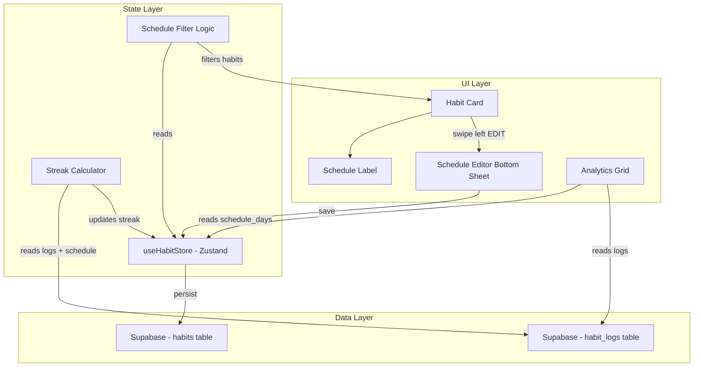

# Design Document: Habit Schedule System

## Overview

The Habit Schedule System extends InTracker Mobile's habit tracking by introducing schedule types (`daily`, `weekly`, `custom`) that control which days a habit appears in the active list. This design covers database schema changes, interface updates, a new Schedule Editor component, filtering logic, streak calculation adjustments, and analytics grid modifications.

The system is designed for backward compatibility — existing habits default to `daily` (all 7 days), preserving current behavior without user intervention.

## Architecture



**Key architectural decisions:**

1. **Schedule data lives on the `habits` table** — Two new columns (`schedule_type`, `schedule_days`) are added directly to the existing table rather than a separate schedule table. This avoids joins and keeps the data model simple for a 1:1 relationship.

2. **Filtering happens client-side** — The Berjalan tab filters habits in the Zustand store based on `schedule_days.includes(currentDayOfWeek)`. This avoids extra Supabase queries and leverages the already-fetched habit list.

3. **Streak calculation is schedule-aware** — The existing streak algorithm in `useHabitStore.ts` is modified to skip non-scheduled days when counting consecutive completions.

4. **Schedule Editor replaces the current edit modal trigger** — The EDIT button on swipe-left opens the new Schedule Editor bottom sheet instead of (or in addition to) the existing edit modal.

## Components and Interfaces

### Updated HabitItem Interface

```typescript
export interface HabitItem {
  id: string;
  user_id?: string;
  name: string;
  subtitle: string;
  frequency: string;
  difficulty: number;
  iconName: string;
  category: string;
  color: string;
  completed: boolean;
  skipped: boolean;
  isSpecial?: boolean;
  specialLabel?: string;
  imageUrl: string;
  imagePosition?: string;
  streak: number;
  target_intensity?: number | null;
  current_intensity?: number;
  position: number;
  // New schedule fields
  schedule_type: 'daily' | 'weekly' | 'custom';
  schedule_days: number[]; // 0=Sun, 1=Mon, ..., 6=Sat
}
```

### Schedule Utility Functions

```typescript
// src/utils/scheduleHelpers.ts

export type ScheduleType = 'daily' | 'weekly' | 'custom';

export interface ScheduleConfig {
  schedule_type: ScheduleType;
  schedule_days: number[];
}

/**
 * Returns default schedule config for habits without schedule data.
 */
export function getDefaultSchedule(): ScheduleConfig {
  return { schedule_type: 'daily', schedule_days: [0, 1, 2, 3, 4, 5, 6] };
}

/**
 * Validates schedule consistency.
 * Returns true if the schedule_type and schedule_days are consistent.
 */
export function isValidSchedule(config: ScheduleConfig): boolean;

/**
 * Returns the display label for a habit's schedule.
 * - daily → "HARIAN"
 * - weekly → abbreviated day name (e.g., "SENIN")
 * - custom → comma-separated abbreviated day names (e.g., "SEN, RAB, JUM")
 */
export function getScheduleLabel(config: ScheduleConfig): string;

/**
 * Filters habits to only those scheduled for the given day of week (0-6).
 */
export function filterHabitsByDay(habits: HabitItem[], dayOfWeek: number): HabitItem[];

/**
 * Determines if a specific date is a scheduled day for a habit.
 */
export function isScheduledDay(date: Date, scheduleDays: number[]): boolean;

/**
 * Calculates streak considering only scheduled days.
 * Walks backward from today, skipping non-scheduled days,
 * counting consecutive scheduled days with completion logs.
 */
export function calculateScheduleAwareStreak(
  scheduleDays: number[],
  completionDates: string[], // sorted descending YYYY-MM-DD
  today?: Date
): number;
```

### Schedule Editor Component

```typescript
// src/mainscreen/habits/ScheduleEditor.tsx

interface ScheduleEditorProps {
  isOpen: boolean;
  onClose: () => void;
  habit: HabitItem;
  onSave: (config: ScheduleConfig) => Promise<void>;
}
```

The Schedule Editor is a bottom sheet (using Framer Motion for slide-up animation) containing:
1. **Schedule Type Selector** — Three pill buttons: Harian, Mingguan, Custom Days
2. **Day Picker** — 7 circular day buttons (Min, Sen, Sel, Rab, Kam, Jum, Sab), shown only for Mingguan/Custom
3. **Save Button** — Validates and persists the selection
4. **Validation Message** — Shown when Mingguan/Custom has no day selected

### Analytics Grid Changes

The `HabitInlineDetail` component in `AnalyticsView.tsx` will be updated to:
- Accept `schedule_days` from the habit
- Mark grid cells as "inactive/grayed" when the cell's day-of-week is NOT in `schedule_days`
- Only color cells (green for completed, empty for missed) on scheduled days

## Data Models

### Database Schema Changes

```sql
-- Migration: Add schedule columns to habits table
ALTER TABLE habits
  ADD COLUMN schedule_type TEXT NOT NULL DEFAULT 'daily'
    CHECK (schedule_type IN ('daily', 'weekly', 'custom')),
  ADD COLUMN schedule_days INTEGER[] NOT NULL DEFAULT '{0,1,2,3,4,5,6}';

-- Populate existing rows (redundant with DEFAULT but explicit)
UPDATE habits
SET schedule_type = 'daily', schedule_days = '{0,1,2,3,4,5,6}'
WHERE schedule_type IS NULL OR schedule_days IS NULL;
```

### Supabase Type Mapping

| Column | Postgres Type | TypeScript Type | Default |
|--------|--------------|-----------------|---------|
| `schedule_type` | `TEXT` with CHECK | `'daily' \| 'weekly' \| 'custom'` | `'daily'` |
| `schedule_days` | `INTEGER[]` | `number[]` | `[0,1,2,3,4,5,6]` |

### Data Flow

1. **Create/Update Habit** → Schedule Editor saves `schedule_type` + `schedule_days` to Supabase
2. **Fetch Habits** → `fetchHabits()` reads schedule columns, applies defaults for null values
3. **Filter for Berjalan** → `filterHabitsByDay(habits, new Date().getDay())` before rendering
4. **Calculate Streak** → `calculateScheduleAwareStreak(habit.schedule_days, logs)` replaces current logic
5. **Render Analytics Grid** → Each cell checks `isScheduledDay(cellDate, habit.schedule_days)`

## Correctness Properties

*A property is a characteristic or behavior that should hold true across all valid executions of a system — essentially, a formal statement about what the system should do. Properties serve as the bridge between human-readable specifications and machine-verifiable correctness guarantees.*

### Property 1: Schedule Data Model Consistency

*For any* habit object, if `schedule_type` is `'daily'` then `schedule_days` must equal `[0,1,2,3,4,5,6]`; if `schedule_type` is `'weekly'` then `schedule_days` must contain exactly one integer in range 0–6; if `schedule_type` is `'custom'` then `schedule_days` must contain one or more integers all in range 0–6.

**Validates: Requirements 1.1, 1.2, 1.3, 1.4, 1.5**

### Property 2: Default Schedule Application

*For any* habit object that lacks `schedule_type` or `schedule_days` fields (or has null values), applying the default schedule function shall produce `schedule_type = 'daily'` and `schedule_days = [0,1,2,3,4,5,6]`.

**Validates: Requirements 1.6, 7.1**

### Property 3: Day-Based Filtering Correctness

*For any* set of habits and *for any* day of the week (0–6), the filtered result of `filterHabitsByDay` shall contain exactly those habits whose `schedule_days` array includes that day, and no others.

**Validates: Requirements 3.1, 3.2, 3.3**

### Property 4: Schedule Label Formatting

*For any* valid schedule configuration, `getScheduleLabel` shall return: `"HARIAN"` when `schedule_type` is `'daily'`; the correct Indonesian abbreviated day name (uppercase) when `schedule_type` is `'weekly'`; a comma-separated list of correct Indonesian abbreviated day names (uppercase, in week order) when `schedule_type` is `'custom'`.

**Validates: Requirements 4.1, 4.2, 4.3**

### Property 5: Analytics Grid Schedule Awareness

*For any* habit with `schedule_type` `'weekly'` or `'custom'`, and *for any* date in the 90-day grid, the grid cell is marked as "active" (eligible for completion coloring) if and only if that date's day-of-week is present in the habit's `schedule_days` array.

**Validates: Requirements 5.2, 5.3**

### Property 6: Schedule-Aware Streak Calculation

*For any* habit with any valid `schedule_days` and *for any* set of completion log dates, the streak calculated by `calculateScheduleAwareStreak` shall equal the count of consecutive scheduled days (walking backward from today) that have a corresponding completion log, skipping all non-scheduled days without breaking the streak.

**Validates: Requirements 6.1, 6.2, 6.3, 6.4**

## Error Handling

| Scenario | Handling |
|----------|----------|
| Habit fetched with `schedule_type = null` | Apply default: `daily`, `[0,1,2,3,4,5,6]` |
| Habit fetched with `schedule_days = null` | Apply default: `[0,1,2,3,4,5,6]` |
| Schedule Editor save with no day selected (weekly/custom) | Show inline validation message, prevent save |
| Supabase update fails on schedule save | Show toast error, revert local state |
| Invalid day value in `schedule_days` (outside 0-6) | Clamp/filter to valid range on read |
| Empty `schedule_days` array for custom type | Treat as daily (fallback) |

## Testing Strategy

### Property-Based Tests (fast-check)

The feature is well-suited for property-based testing because the core logic involves pure functions (filtering, label formatting, streak calculation) with clear input/output behavior and large input spaces.

**Library:** [fast-check](https://github.com/dubzzz/fast-check) (already compatible with Vitest)

**Configuration:**
- Minimum 100 iterations per property test
- Each test tagged with: `Feature: habit-schedule-system, Property {N}: {description}`

**Properties to implement:**
1. Schedule data model consistency — generate random schedule configs, validate invariants
2. Default schedule application — generate habits with missing fields, verify defaults
3. Day-based filtering — generate random habit lists + random day, verify filter correctness
4. Schedule label formatting — generate all valid schedule configs, verify label output
5. Analytics grid schedule awareness — generate schedule + date range, verify cell states
6. Schedule-aware streak calculation — generate schedule + random log dates, verify streak count

### Unit Tests (Vitest)

- Schedule Editor renders correctly for each schedule type (example-based)
- Day Picker enforces single-select for weekly, multi-select for custom (example-based)
- Validation prevents save without day selection (edge case)
- EDIT button opens Schedule Editor (example-based)
- Analytics grid renders grayed cells for non-scheduled days (example-based)

### Integration Tests

- Save schedule to Supabase and re-fetch verifies persistence
- Migration populates defaults for existing habits
- Streak calculation with real habit_logs data from Supabase
