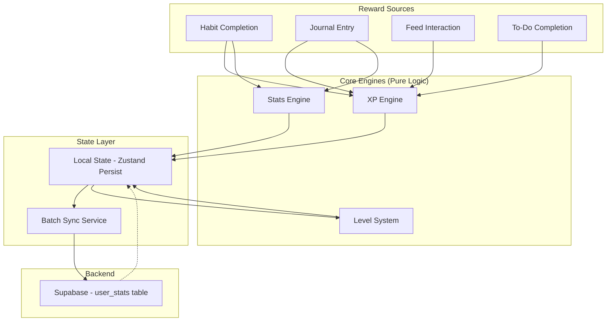

# Design Document: RPG Stats & XP System

## Overview

This design replaces InTracker Mobile's formula-based stat calculations with a persistent RPG progression system. The system introduces three core engines — XP Engine, Stats Engine, and Level System — that award experience points and stat points through user activities (habit completions, journaling, feed interactions, to-do completions). All progression data is stored locally via Zustand persist for instant UI feedback and synced to Supabase in batched writes.

The architecture follows a local-first pattern consistent with the existing codebase (e.g., `useHabitStore`), where state updates happen optimistically and sync to the backend asynchronously. Daily caps prevent abuse, and a one-time migration converts existing formula-based stats into the new persistent model.

## Architecture



### Design Decisions

1. **Pure engine functions**: XP Engine, Stats Engine, and Level System are implemented as pure functions (no side effects). This makes them independently testable and composable. The Zustand store orchestrates calls to these engines.

2. **Single store for progression**: All progression data lives in one `useProgressionStore` rather than being split across multiple stores. This simplifies daily cap tracking and batch sync logic.

3. **Event-driven reward processing**: Each reward source dispatches a `RewardEvent` object to a central `processReward` function, which coordinates XP and stat calculations before updating state.

4. **Batch sync with debounce**: Rather than syncing on every state change, a 30-second debounced timer batches all pending changes into a single Supabase upsert.

## Components and Interfaces

### XP Engine (`src/engines/xpEngine.ts`)

Pure functions for XP calculation and cap enforcement.

```typescript
interface XPAwardResult {
  awarded: number;
  capped: boolean;
  newDailyTotal: number;
}

interface DailyXPState {
  dailyXPEarned: number;
  dailyFeedXPEarned: number;
  dailyJournalCount: number;
  lastResetDate: string; // YYYY-MM-DD
}

function calculateHabitXP(difficulty: number): number;
function calculateJournalXP(contentLength: number, dailyJournalCount: number): number;
function calculateFeedXP(dailyFeedXPEarned: number): number;
function calculateTodoXP(): number;

function applyDailyCap(
  baseXP: number,
  dailyXPEarned: number,
  dailyCap: number
): XPAwardResult;

function applyFeedSubCap(
  baseXP: number,
  dailyFeedXPEarned: number,
  feedCap: number
): XPAwardResult;
```

### Stats Engine (`src/engines/statsEngine.ts`)

Pure functions for stat point calculation and per-category cap enforcement.

```typescript
type StatCategory = 'kebijaksanaan' | 'kepercayaanDiri' | 'kekuatan' | 'disiplin' | 'fokus';

interface HabitStatsMap {
  categories: Array<{ category: StatCategory; points: 1 | 2 }>;
}

interface StatAwardResult {
  awards: Record<StatCategory, number>; // actual points awarded per category
  capped: Record<StatCategory, boolean>;
}

interface DailyStatState {
  dailyStatEarned: Record<StatCategory, number>;
  lastResetDate: string;
}

function getDefaultHabitStatsMap(habitCategory: string, difficulty: number): HabitStatsMap;
function getJournalStatsMap(): HabitStatsMap;

function applyStatCaps(
  statsMap: HabitStatsMap,
  dailyStatEarned: Record<StatCategory, number>,
  categoryCap: number
): StatAwardResult;
```

### Level System (`src/engines/levelSystem.ts`)

Pure functions for level calculation from total XP.

```typescript
interface LevelInfo {
  level: number;
  currentLevelXP: number;    // XP earned within current level
  nextLevelXP: number;       // XP needed for next level
  totalXPForLevel: number;   // cumulative XP threshold for current level
  progress: number;          // 0-1 fraction toward next level
}

function calculateLevel(totalXP: number): number;
function getLevelInfo(totalXP: number): LevelInfo;
function getXPThresholdForLevel(level: number): number;
function validateLevelConsistency(totalXP: number, storedLevel: number): number;
```

The level curve uses a progressive formula where each level requires incrementally more XP:
- Level 1: 100 XP cumulative
- XP for level N to N+1 = `base * scalingFactor^(N-1)` where base ≈ 100 and scalingFactor ≈ 1.04
- This produces ~level 30 at 45,000 XP (day 90 at 500 XP/day)
- Max level: 100

### Progression Store (`src/store/useProgressionStore.ts`)

Zustand store with persist middleware managing all progression state.

```typescript
interface ProgressionState {
  // Cumulative values
  totalXP: number;
  level: number;
  stats: Record<StatCategory, number>;

  // Daily tracking
  dailyXPEarned: number;
  dailyFeedXPEarned: number;
  dailyJournalCount: number;
  dailyStatEarned: Record<StatCategory, number>;
  lastResetDate: string;

  // Sync tracking
  pendingSync: boolean;
  syncRetryCount: number;
  lastSyncTimestamp: number;

  // Migration
  migrationCompleted: boolean;

  // To-do dedup
  completedTodoIds: Set<string>;
}

interface ProgressionActions {
  processHabitCompletion: (habitId: string, difficulty: number, category: string) => void;
  processJournalEntry: (contentLength: number) => void;
  processFeedInteraction: () => void;
  processTodoCompletion: (todoId: string) => void;
  reconcileWithServer: (serverData: UserStatsRow) => void;
  runMigration: (habitLogs: any[], streakData: any) => Promise<void>;
  resetDailyCaps: () => void;
}
```

### Batch Sync Service (`src/services/batchSync.ts`)

Handles debounced writes to Supabase.

```typescript
interface BatchSyncConfig {
  debounceMs: number;       // 30000 (30 seconds)
  maxRetries: number;       // 5
}

function scheduleBatchSync(state: ProgressionState): void;
function executeBatchSync(state: ProgressionState): Promise<boolean>;
function reconcileOnLaunch(): Promise<void>;
```

### Migration Service (`src/services/migrationService.ts`)

One-time migration from formula-based stats to persistent stats.

```typescript
interface MigrationResult {
  totalXP: number;
  level: number;
  stats: Record<StatCategory, number>;
}

function calculateMigrationValues(
  habitLogs: HabitLog[],
  streakData: any
): MigrationResult;
```

## Data Models

### Supabase `user_stats` Table

| Column | Type | Description |
|--------|------|-------------|
| `user_id` | uuid (PK, FK → auth.users) | User identifier |
| `total_xp` | integer | Cumulative XP earned |
| `level` | integer | Current level (1-100) |
| `stat_kebijaksanaan` | integer | Wisdom cumulative points |
| `stat_kepercayaan_diri` | integer | Confidence cumulative points |
| `stat_kekuatan` | integer | Strength cumulative points |
| `stat_disiplin` | integer | Discipline cumulative points |
| `stat_fokus` | integer | Focus cumulative points |
| `daily_xp_earned` | integer | XP earned today |
| `daily_feed_xp_earned` | integer | Feed XP earned today |
| `daily_journal_count` | integer | Journal entries today |
| `daily_stat_kebijaksanaan` | integer | Wisdom points earned today |
| `daily_stat_kepercayaan_diri` | integer | Confidence points earned today |
| `daily_stat_kekuatan` | integer | Strength points earned today |
| `daily_stat_disiplin` | integer | Discipline points earned today |
| `daily_stat_fokus` | integer | Focus points earned today |
| `last_reset_date` | date | Last daily cap reset date |
| `migration_completed` | boolean | Whether migration has run |
| `completed_todo_ids` | text[] | To-do IDs already rewarded |
| `updated_at` | timestamptz | Last update timestamp |

### Local State Shape (Zustand Persist)

```typescript
{
  totalXP: 0,
  level: 1,
  stats: {
    kebijaksanaan: 0,
    kepercayaanDiri: 0,
    kekuatan: 0,
    disiplin: 0,
    fokus: 0
  },
  dailyXPEarned: 0,
  dailyFeedXPEarned: 0,
  dailyJournalCount: 0,
  dailyStatEarned: {
    kebijaksanaan: 0,
    kepercayaanDiri: 0,
    kekuatan: 0,
    disiplin: 0,
    fokus: 0
  },
  lastResetDate: "2025-01-01",
  pendingSync: false,
  syncRetryCount: 0,
  lastSyncTimestamp: 0,
  migrationCompleted: false,
  completedTodoIds: []
}
```

### Habit Stats Map Defaults

| Habit Category | Stat 1 | Stat 2 | Stat 3 (difficulty 3 only) |
|---------------|---------|---------|---------------------------|
| Latihan Fisik | Kekuatan (+2) | Disiplin (+1) | Kepercayaan Diri (+1) |
| Ketenangan Diri | Kebijaksanaan (+2) | Fokus (+1) | Disiplin (+1) |
| Evolusi Diri | Fokus (+2) | Kepercayaan Diri (+1) | Kebijaksanaan (+1) |
| Rutinitas | Disiplin (+2) | Kepercayaan Diri (+1) | Fokus (+1) |


## Correctness Properties

*A property is a characteristic or behavior that should hold true across all valid executions of a system — essentially, a formal statement about what the system should do. Properties serve as the bridge between human-readable specifications and machine-verifiable correctness guarantees.*

### Property 1: XP Daily Cap Enforcement

*For any* habit difficulty (1, 2, or 3) and any dailyXPEarned value between 0 and 1000, the XP awarded by the XP Engine SHALL equal `min(habitXP, 1000 - dailyXPEarned)`, and the resulting dailyXPEarned SHALL never exceed 1000.

**Validates: Requirements 1.1, 1.2, 1.3**

### Property 2: Journal Content Length Validation

*For any* string of arbitrary length, the XP Engine SHALL award 30 XP if and only if the string length is >= 20 characters, and SHALL award 0 XP if the string length is < 20 characters (regardless of daily cap status).

**Validates: Requirements 2.1**

### Property 3: Journal Daily Count Cap

*For any* dailyJournalCount value, the XP Engine SHALL award journal XP if and only if dailyJournalCount < 5. When dailyJournalCount >= 5, the XP Engine SHALL award 0 XP for journal submissions.

**Validates: Requirements 2.4**

### Property 4: Feed Interaction Sub-Cap

*For any* dailyFeedXPEarned value, the XP Engine SHALL award 10 XP for a feed interaction if and only if dailyFeedXPEarned < 200. When dailyFeedXPEarned >= 200, the XP Engine SHALL award 0 XP for additional feed interactions. The feed sub-cap operates independently of the global 1000 XP daily cap.

**Validates: Requirements 3.5**

### Property 5: To-Do XP Deduplication

*For any* to-do item ID and any sequence of complete/uncomplete actions, the XP Engine SHALL award XP exactly once for the first completion. All subsequent completions of the same to-do ID SHALL award 0 XP regardless of uncomplete actions in between.

**Validates: Requirements 4.4**

### Property 6: Stat Awards Match Stats Map Categories

*For any* valid HabitStatsMap with 2 or 3 categories, the Stats Engine SHALL award points only to the categories listed in the map, and the awarded amount for each category SHALL equal the map's specified value (subject to daily caps).

**Validates: Requirements 5.1**

### Property 7: Stats Map Structure Invariant

*For any* habit with difficulty 1 or 2, the generated HabitStatsMap SHALL contain exactly 2 categories with point values (+2, +1) totaling 3. *For any* habit with difficulty 3, the generated HabitStatsMap SHALL contain exactly 3 categories with point values (+2, +1, +1) totaling 4. In all cases, the total stat points per completion SHALL not exceed 4.

**Validates: Requirements 5.2, 7.5, 7.6, 7.7**

### Property 8: Per-Category Stat Cap Independence

*For any* combination of dailyStatEarned values (0-10 per category) and any valid HabitStatsMap, the Stats Engine SHALL cap each category independently at 10. A category at its cap SHALL receive 0 points while other uncapped categories in the same completion SHALL still receive their full award.

**Validates: Requirements 5.3**

### Property 9: Level Calculation Monotonicity and Correctness

*For any* two total XP values where xp1 <= xp2, `calculateLevel(xp1) <= calculateLevel(xp2)`. Additionally, *for all* levels N from 1 to 99, the XP increment required from level N to N+1 SHALL be strictly greater than the increment from level N-1 to N. The calculated level SHALL never exceed 100.

**Validates: Requirements 8.1, 8.3, 8.5**

### Property 10: Level Consistency Validation

*For any* (totalXP, storedLevel) pair, `validateLevelConsistency(totalXP, storedLevel)` SHALL return `calculateLevel(totalXP)`, correcting any inconsistency between stored level and actual XP.

**Validates: Requirements 8.6**

### Property 11: Level Info Progress Consistency

*For any* totalXP value, `getLevelInfo(totalXP)` SHALL return a LevelInfo where: `currentLevelXP >= 0`, `nextLevelXP > 0` (unless at max level), `progress` is between 0 and 1 (inclusive), and `currentLevelXP / nextLevelXP == progress` (within floating point tolerance).

**Validates: Requirements 8.7**

### Property 12: Daily Cap Reset on Date Change

*For any* pair of dates (currentDate, lastResetDate) where currentDate != lastResetDate, processing a reward SHALL first reset dailyXPEarned to 0, dailyFeedXPEarned to 0, dailyJournalCount to 0, and all five dailyStatEarned values to 0, and update lastResetDate to currentDate.

**Validates: Requirements 10.1, 10.2**

### Property 13: Daily State Range Validation

*For any* dailyXPEarned value outside the range [0, 1000] or any per-category dailyStatEarned value outside the range [0, 10], the system SHALL reject the invalid state and prevent further operations until corrected.

**Validates: Requirements 10.3, 10.4**

### Property 14: Batch Sync Retry Behavior

*For any* sequence of sync failures, the system SHALL retry up to 5 consecutive times. After 5 consecutive failures, the system SHALL stop automatic retries and wait for the next Reward_Source event to re-initiate sync. Pending changes SHALL be retained throughout all retries.

**Validates: Requirements 11.4**

### Property 15: Reconciliation Takes Maximum Values

*For any* local state and server state pair, the reconciled state SHALL equal `max(local, server)` for each of: totalXP, level, and all five stat category cumulative values.

**Validates: Requirements 12.3**

## Error Handling

### XP Engine Errors

| Scenario | Handling |
|----------|----------|
| Invalid difficulty value (not 1, 2, or 3) | Default to difficulty 1 (15 XP) |
| Daily XP counter corrupted (outside 0-1000) | Reject state, block XP operations, log error |
| Negative XP calculation result | Clamp to 0, never subtract XP |

### Stats Engine Errors

| Scenario | Handling |
|----------|----------|
| Unknown habit category | Award 0 stat points (empty stats map) |
| Daily stat counter corrupted (outside 0-10) | Reject state, block stat operations for that category |
| Stats map with invalid point values | Reject the map, award 0 stat points |

### Level System Errors

| Scenario | Handling |
|----------|----------|
| Negative total XP | Treat as 0, level = 0 |
| Level/XP inconsistency detected | Force-correct level to match XP |
| XP exceeds level 100 threshold | Cap level at 100, continue accumulating XP |

### Batch Sync Errors

| Scenario | Handling |
|----------|----------|
| Network timeout | Increment retry counter, schedule next retry |
| Supabase auth expired | Attempt token refresh, then retry |
| 5 consecutive failures | Stop retries, retain pending data, wait for next reward event |
| Conflict on upsert | Use `max()` reconciliation strategy |

### Migration Errors

| Scenario | Handling |
|----------|----------|
| habit_logs table empty or inaccessible | Initialize all values to 0, mark migration complete |
| Calculation produces invalid values | Clamp to valid ranges, mark migration complete |
| Migration interrupted mid-write | Re-run on next app launch (migration_completed still false) |

## Testing Strategy

### Property-Based Testing

This feature is well-suited for property-based testing because the core engines (XP, Stats, Level) are pure functions with clear input/output behavior and universal properties that hold across wide input spaces.

**Library**: [fast-check](https://github.com/dubzzz/fast-check) (TypeScript PBT library, integrates with Vitest)

**Configuration**:
- Minimum 100 iterations per property test
- Each property test references its design document property
- Tag format: `Feature: rpg-stats-xp-system, Property {number}: {property_text}`

**Test file structure**:
```
src/engines/__tests__/
  xpEngine.property.test.ts    (Properties 1-5)
  statsEngine.property.test.ts (Properties 6-8)
  levelSystem.property.test.ts (Properties 9-11)
  dailyReset.property.test.ts  (Properties 12-13)
  batchSync.property.test.ts   (Property 14)
  reconciliation.property.test.ts (Property 15)
```

### Unit Tests (Example-Based)

Unit tests cover specific examples, fixed mappings, and edge cases:

- XP values per difficulty (15, 25, 40)
- Feed interaction awards exactly 10 XP with no stats
- To-do completion awards exactly 10 XP with no stats
- Journal awards +1 kebijaksanaan and +1 fokus
- Default habit-to-stats mappings for each category
- Level at 45,000 XP is between 28-32
- Day 90 stat total for consistent user is 810-990
- Migration with empty data initializes to zero
- Migration flag prevents re-run

### Integration Tests

Integration tests verify Supabase interactions:

- Batch sync writes to user_stats table within 30 seconds
- Reconciliation on app launch fetches server data
- Migration writes initial values and sets flag
- Offline behavior retains local data

### Test Dependencies to Add

```json
{
  "devDependencies": {
    "vitest": "^3.0.0",
    "fast-check": "^4.0.0",
    "@testing-library/react": "^16.0.0"
  }
}
```

### Test Scripts

```json
{
  "scripts": {
    "test": "vitest --run",
    "test:watch": "vitest",
    "test:property": "vitest --run src/engines/__tests__/*.property.test.ts"
  }
}
```
